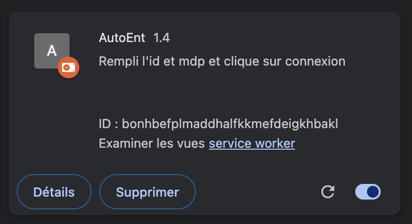
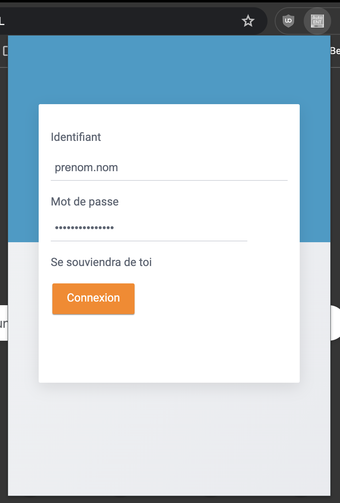

# Extension Chrome AutoEnt

AutoEnt est une extension Chrome qui débloque gratuitement tous les articles sur Annabac. Dites adieu aux barrières de paiement et accédez aux contenus Annabac sans aucune restriction.

## Installation

1. Téléchargez l'archive .zip de l'extension [ici](https://github.com/NohamR/AutoEnt/releases/latest) et déziper la.

2. Allez sur [chrome://extensions/](chrome://extensions/).
Activez le mode "Développeur" dans le coin supérieur droit.
Cliquez sur "Charger l'extension non empaquetée" et sélectionnez le dossier de l'extension.

3. Cliquez sur l'icon de l'extension pour paramétrer votre identifiant et votre mot de passe habituel.

Les identifiants et mot de passe sont stockés localement sur votre machine et ne seront jamais partagés. Pour en être sûr les script utilisant les mots de passe sont les suivants : [content.js](content.js) [popup.js](dupe/popup.js)

## Utilisation
Le nom d'utilisateur et le mot de passe seront automatiquement remplis. Le bouton "se connecter" est cliqué toutes les deux secondes.

## Avertissement
Cette extension est destinée à des fins éducatives et informatives uniquement. Le développeur n'est pas responsable de tout usage abusif ou d'un accès non autorisé au contenu.